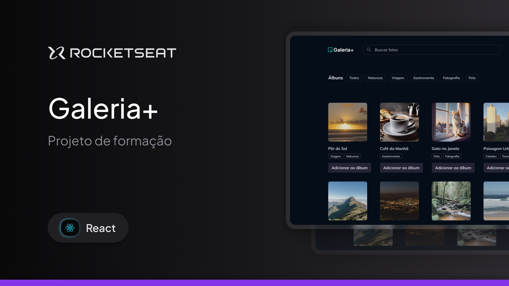

# Gallery Plus - Rocketseat React

O **Gallery Plus** é uma aplicação desenvolvida em **React** para gerenciamento de uma galeria de fotos, permitindo adicionar imagens, organizar fotos em álbuns e visualizar o conteúdo de forma simples e intuitiva.

O projeto foi desenvolvido durante a formação **React da Rocketseat**, com foco na prática de conceitos importantes do ecossistema React, como componentização, formulários, validação de dados, criação de hooks personalizados, gerenciamento de estados assíncronos e construção de componentes reutilizáveis.

---

## 🛠 **Tecnologias e Ferramentas**

Aqui estão as tecnologias utilizadas no desenvolvimento deste projeto:

- **React**: Biblioteca para construção da interface da aplicação
- **TypeScript**: Tipagem estática para maior segurança e organização do código
- **Vite**: Ferramenta de build e servidor de desenvolvimento
- **Tailwind CSS**: Estilização utilitária e responsiva
- **Tailwind Variants**: Criação e gerenciamento de variantes de componentes
- **Radix UI**: Componentes primitivos acessíveis utilizados na construção da interface
- **React Router**: Gerenciamento das rotas e navegação da aplicação
- **React Hook Form**: Gerenciamento e controle dos formulários
- **Zod**: Criação de schemas e validação dos dados dos formulários
- **TanStack React Query**: Gerenciamento de requisições, cache e estados assíncronos
- **Axios**: Comunicação HTTP entre a aplicação e o servidor
- **nuqs**: Gerenciamento de estados através dos parâmetros da URL
- **Sonner**: Exibição de notificações e feedbacks ao usuário
- **SVGR**: Utilização de arquivos SVG como componentes React

---

## 💻 **Projeto**

Confira abaixo uma prévia:



---

## ✅ **Funcionalidades**

- Adição de novas fotos à galeria
- Upload de imagens nos formatos PNG, JPG e JPEG
- Pré-visualização da imagem antes do envio
- Criação e gerenciamento de álbuns
- Associação de uma foto a um ou mais álbuns
- Seleção de múltiplas fotos durante a criação de álbuns
- Validação de formulários e arquivos
- Feedback visual durante operações assíncronas
- Estados de carregamento com Skeleton Loading
- Tratamento de estados vazios
- Componentes reutilizáveis
- Interface responsiva

---

## ⚙️ Instalação e Execução

Siga os passos abaixo para clonar o projeto e executá-lo localmente em sua máquina:

### ✅ Pré-requisitos

- [Node.js](https://nodejs.org/) instalado
- [Git](https://git-scm.com/) instalado
- [pnpm](https://pnpm.io/) instalado

### 📥 1. Clone o repositório

```bash
git clone https://github.com/murilloressineti/react-rocketseat
```

### 📂 2. Acesse a pasta do projeto

```bash
cd react-rocketseat/gallery-plus
```

### 📦 3. Instale as dependências

```bash
pnpm install
```

### 🗄️ 4. Execute o servidor

```bash
pnpm dev-server
```

### 🚀 5. Execute o projeto

```bash
pnpm dev
```

---

## 📝 **Licença**

Este projeto está sob a licença **MIT**. Para mais detalhes, consulte o arquivo [LICENSE](./LICENSE).

---

## 👨🏻‍💻 **Autor**

Feito por **Murillo Ressineti**, aluno da Rocketseat e desenvolvedor Front-end. Conecte-se comigo no LinkedIn para mais informações:

[](https://www.linkedin.com/in/murilloressineti/)

---

## 📬 **Contato**

Se você tiver dúvidas, sugestões ou gostaria de discutir sobre o projeto, sinta-se à vontade para entrar em contato!