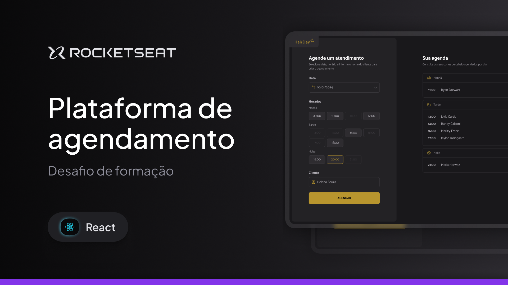

# HairDay - Rocketseat React

O **HairDay** é uma aplicação de agendamento para cabeleireiros desenvolvida em **React**, permitindo cadastrar, visualizar e remover agendamentos de clientes de forma simples e organizada.

O projeto foi desenvolvido como desafio da formação **React da Rocketseat**, com foco na aplicação prática de conceitos fundamentais do React, como componentização, gerenciamento e compartilhamento de estado, comunicação entre componentes, regras de negócio e persistência de dados no navegador.

---

## 🛠 **Tecnologias e Ferramentas**

Aqui estão as tecnologias utilizadas no desenvolvimento deste projeto:

- **React**: Biblioteca para construção da interface e gerenciamento dos componentes
- **Vite**: Ferramenta de build e servidor de desenvolvimento
- **TypeScript**: Tipagem estática para maior segurança e organização do código
- **Tailwind CSS**: Estilização utilitária e responsiva
- **Class Variance Authority (CVA)**: Gerenciamento de variantes dos componentes
- **clsx**: Composição condicional de classes CSS
- **tailwind-merge**: Resolução de conflitos entre classes do Tailwind CSS
- **vite-plugin-svgr**: Utilização de arquivos SVG como componentes React
- **Sonner**: Feedback visual através de notificações Toast
- **React Hooks**: Gerenciamento de estado e efeitos da aplicação
- **Local Storage**: Persistência dos agendamentos no navegador
- **Git e GitHub**: Controle de versão e hospedagem do código

---

## 💻 **Projeto**

Confira abaixo uma prévia e acesse o projeto completo [aqui](https://apphairday.vercel.app/):



---

## ✅ **Funcionalidades**

- Criação de novos agendamentos
- Seleção de data e horário
- Listagem de agendamentos por data
- Organização dos horários por manhã, tarde e noite
- Sincronização da data entre formulário e agenda
- Bloqueio de horários já ocupados
- Bloqueio de datas e horários anteriores ao momento atual
- Exclusão de agendamentos com confirmação
- Validação dos campos do formulário
- Feedback de sucesso e erro através de Toast
- Persistência dos agendamentos utilizando Local Storage
- Componentes reutilizáveis
- Interface responsiva para desktop e dispositivos móveis

---

## ⚙️ Instalação e Execução

Siga os passos abaixo para clonar o projeto e executá-lo localmente em sua máquina:

### ✅ Pré-requisitos

- [Node.js](https://nodejs.org/) instalado
- [Git](https://git-scm.com/) instalado
- [pnpm](https://pnpm.io/) instalado

### 📥 1. Clone o repositório

```bash
git clone https://github.com/murilloressineti/react-rocketseat
```

### 📂 2. Acesse a pasta do projeto

```bash
cd react-rocketseat/hair-day
```

### 📦 3. Instale as dependências

```bash
pnpm install
```

### 🚀 4. Execute o projeto

```bash
pnpm dev
```

---

## 📝 **Licença**

Este projeto está sob a licença **MIT**. Para mais detalhes, consulte o arquivo [LICENSE](./LICENSE).

---

## 👨🏻‍💻 **Autor**

Feito por **Murillo Ressineti**, aluno da Rocketseat e desenvolvedor Front-end. Conecte-se comigo no LinkedIn para mais informações:

[](https://www.linkedin.com/in/murilloressineti/)

---

## 📬 **Contato**

Se você tiver dúvidas, sugestões ou gostaria de discutir sobre o projeto, sinta-se à vontade para entrar em contato!