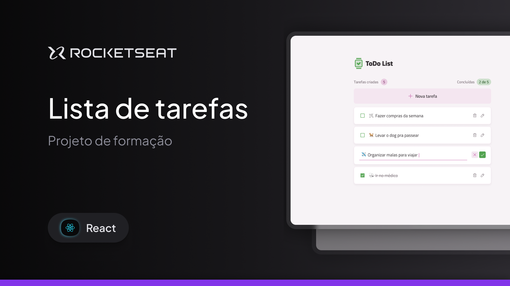

# Lista de Tarefas - Rocketseat React

A **Lista de Tarefas** é uma aplicação desenvolvida em **React** para gerenciamento de tarefas do dia a dia, permitindo criar, editar, concluir e remover atividades de forma simples e intuitiva.

O projeto foi desenvolvido durante a formação **React da Rocketseat**, com foco na prática de conceitos essenciais do React, como componentização, gerenciamento de estado, criação de hooks personalizados e construção de interfaces reutilizáveis.

---

## 🛠 **Tecnologias e Ferramentas**

Aqui estão as tecnologias utilizadas no desenvolvimento deste projeto:

- **React**: Biblioteca para construção da interface da aplicação
- **Vite**: Ferramenta de build e servidor de desenvolvimento
- **TypeScript**: Tipagem estática para maior segurança e organização
- **Tailwind CSS**: Estilização utilitária e responsiva
- **Class Variance Authority (CVA)**: Gerenciamento de variantes de componentes
- **React Hooks**: Controle de estado e lógica da aplicação
- **Git e GitHub**: Controle de versão e hospedagem do código

---

## 💻 **Projeto**

Confira abaixo uma prévia e acesse o projeto completo [aqui](https://to-do-deploy-react.vercel.app/):



---

## ✅ **Funcionalidades**

- Criação de novas tarefas
- Edição do título das tarefas
- Marcação de tarefas como concluídas
- Exclusão de tarefas
- Cancelamento da criação ou edição de tarefas
- Componentes reutilizáveis
- Interface responsiva
- Estados de carregamento (Skeleton Loading)

---

## ⚙️ Instalação e Execução

Siga os passos abaixo para clonar o projeto e executá-lo localmente em sua máquina:

### ✅ Pré-requisitos

- [Node.js](https://nodejs.org/) instalado
- [Git](https://git-scm.com/) instalado
- [pnpm](https://pnpm.io/) instalado

### 📥 1. Clone o repositório

```bash
git clone https://github.com/murilloressineti/react-rocketseat
```

### 📂 2. Acesse a pasta do projeto

```bash
cd react-rocketseat/to-do
```

### 📦 3. Instale as dependências

```bash
pnpm install
```

### 🚀 4. Execute o projeto

```bash
pnpm dev
```

---

## 📝 **Licença**

Este projeto está sob a licença **MIT**. Para mais detalhes, consulte o arquivo [LICENSE](./LICENSE).

---

## 👨🏻‍💻 **Autor**

Feito por **Murillo Ressineti**, aluno da Rocketseat e desenvolvedor Front-end. Conecte-se comigo no LinkedIn para mais informações:

[](https://www.linkedin.com/in/murilloressineti/)

---

## 📬 **Contato**

Se você tiver dúvidas, sugestões ou gostaria de discutir sobre o projeto, sinta-se à vontade para entrar em contato!